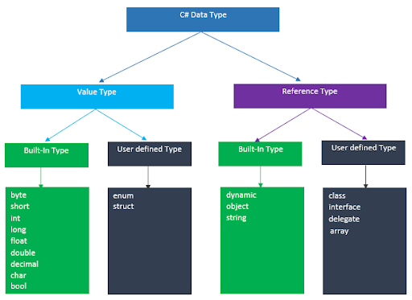

# CSharp-Question-Answer
Learn C# interview, Interview Guid

1) ### What is c# ?
    C# is a strongly typed, object-oriented and managed programming language that is compiled by .Net framework to generate Microsoft Intermediate Language.
    
    [Reference(MS)](https://learn.microsoft.com/en-us/dotnet/csharp/tour-of-csharp/)
    
    
 2) ### What is Data Type? (Explain Data type in C#)
    Data Type refers to the type of data that can be stored in a variable.C# is rich in data type which is mainly divided into two categories.

      1. Value Type
    
      2. Reference Type

     
     
     
         Value Type: 
     A value type variable stores actual values.
     
     Values types are of two types - built-in and user-defined. 
     
     Value types are stored in a stack and derived from System.ValueType class.

        Reference Type: 
    A reference type variable stores a reference to the actual value. Typically, a reference type contains a pointer to another memory location that stores the actual          data. 
    
    Reference types are of two types - built-in and user-defined. 
    
    Reference types are stored in a heap and derived from System.Object class.

